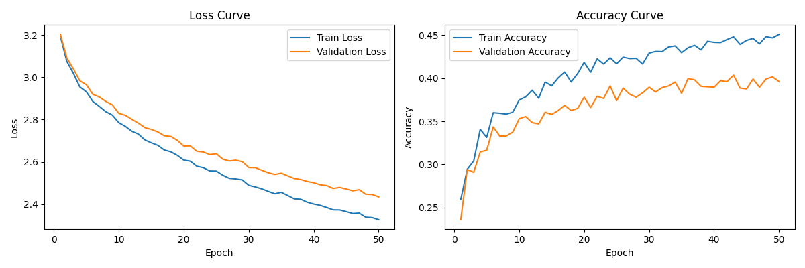
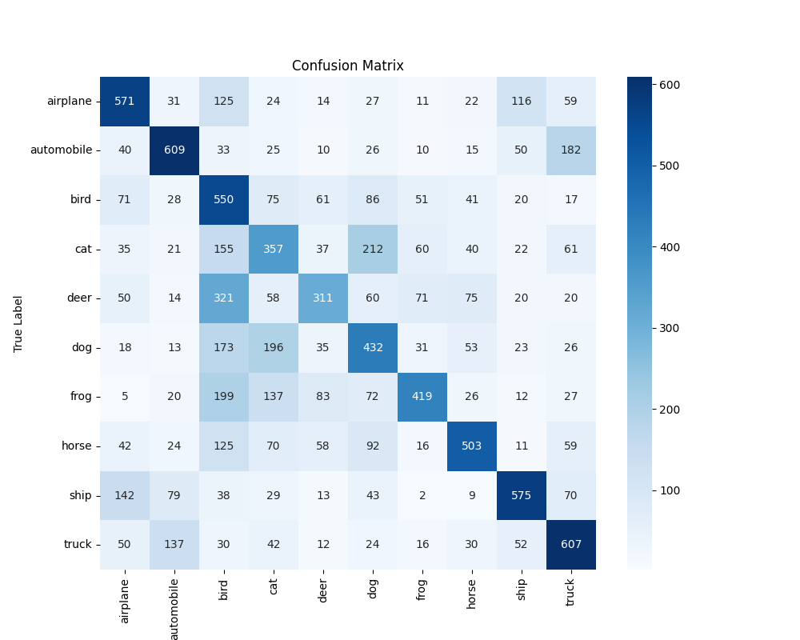
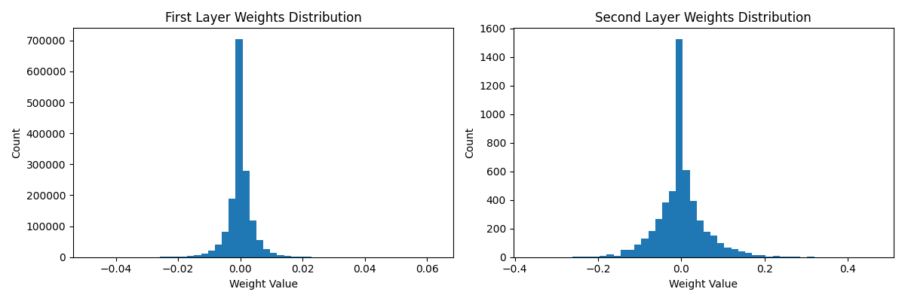

# CIFAR-10 图像分类器

这是一个使用全连接神经网络实现的CIFAR-10图像分类器。项目完全使用NumPy实现，不依赖任何深度学习框架。

## 数据集下载

CIFAR-10数据集可以从以下链接下载：
- 官方下载链接：https://www.cs.toronto.edu/~kriz/cifar.html
- 直接下载链接：https://www.cs.toronto.edu/~kriz/cifar-10-python.tar.gz

下载后，请将数据集解压到项目根目录下的 `cifar-10-batches-py` 文件夹中。

## 项目结构

- `data_loader.py`: 数据加载和预处理模块
- `model.py`: 神经网络模型定义
- `train.py`: 模型训练脚本
- `test.py`: 模型测试脚本
- `hyperparameter_search.py`: 超参数搜索脚本

## 功能特点

1. 自主实现的反向传播算法
2. 支持自定义隐藏层大小和激活函数
3. 实现了SGD优化器、学习率衰减、交叉熵损失和L2正则化
4. 分批次训练，支持自定义批量大小
5. 实时训练进度显示和性能监控
6. 丰富的可视化功能：
   - 训练历史曲线（损失和准确率）
   - 混淆矩阵
   - 权重分布图

## 使用方法

### 1. 安装依赖

```bash
pip install numpy matplotlib seaborn scikit-learn tqdm
```

### 2. 训练模型

```bash
python train.py
```

默认参数：
- 隐藏层大小：512
- 激活函数：ReLU
- 学习率：0.01
- 正则化强度：0.01
- 批量大小：32
- 训练轮数：100

训练过程中会显示：
- 训练参数概览
- 每个epoch的进度条，包含当前批次的损失和准确率
- 每个epoch结束后的训练集和验证集性能
- 训练结束后的测试集性能

### 3. 测试模型

```bash
python test.py
```

### 4. 超参数搜索

```bash
python hyperparameter_search.py
```

## 可视化结果

### 训练历史
运行以下命令以生成训练历史图表：
```bash
python visualize_training.py
```


### 混淆矩阵
运行以下命令以生成混淆矩阵：
```bash
python -c "from model import NeuralNetwork; nn = NeuralNetwork(...); nn.plot_confusion_matrix(...)"
```


### 权重分布
运行以下命令以生成权重分布图：
```bash
python -c "from model import NeuralNetwork; nn = NeuralNetwork(...); nn.plot_weights()"
```


## 注意事项

1. 确保CIFAR-10数据集已下载并放在`cifar-10-batches-py`目录下
2. 训练过程中会自动保存最佳模型到`best_model.npz`
3. 可视化图表会自动保存到当前目录
4. 建议在训练过程中观察损失和准确率的变化，以便及时调整超参数 